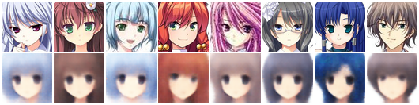
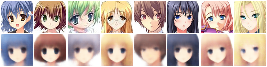
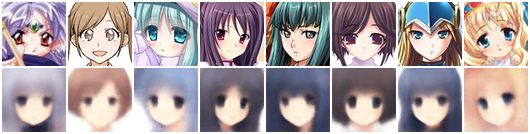
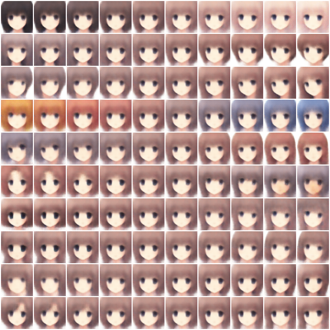
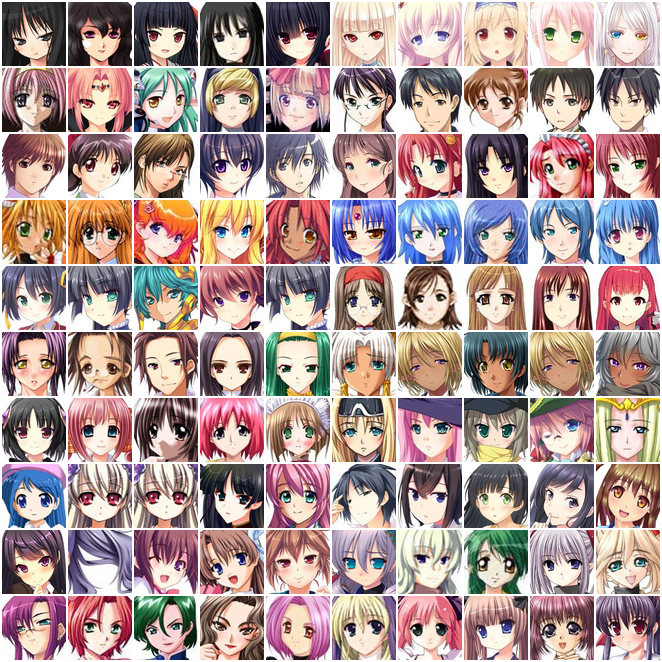
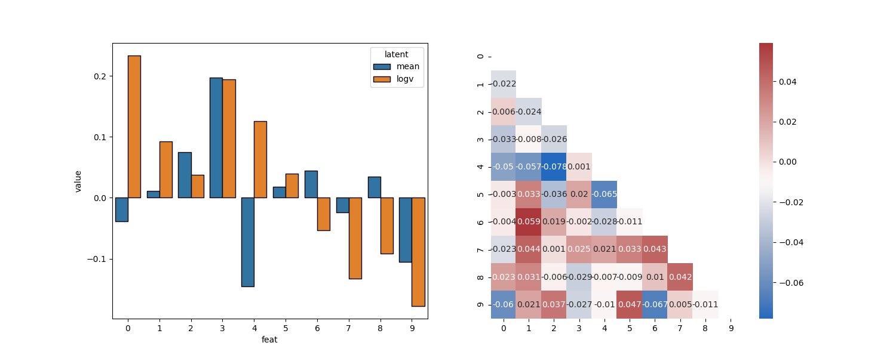

VAE animeface
=============
Variational autoencoder for anime face reconstruction

Introduction
------------
This repository is an exploratory example to train a variational autoencoder to extract meaningful 
feature representations of anime girl face images.

The code architecture is mostly borrowed and modified from Yann Dubois's `disentangling-vae`_ repository. 
It has nice summarization and comparison of the different VAE model proposed recently.

.. _disentangling-vae: https://github.com/YannDubs/disentangling-vae

Dataset
-----------
`Anime Face Dataset`_ contains 63,632 anime faces. (all rescaled to 64x64 in training)

.. _Anime Face Dataset: https://www.kaggle.com/splcher/animefacedataset

.. image:: https://raw.githubusercontent.com/Mckinsey666/Anime-Face-Dataset/master/test.jpg

Model
-----------
The model used is the one proposed in the paper `Understanding disentangling in β-VAE`_, which is summarized below:

.. _Understanding disentangling in β-VAE: https://arxiv.org/abs/1804.03599

.. image:: https://github.com/YannDubs/disentangling-vae/raw/master/doc/imgs/architecture.png

I used ``laplace`` as the target distribution to calculate the reconstruction loss. 
From Yann's code, it suggests that ``bernoulli`` would generally a better choice, but it looks it converge 
slowly in my case. (I didn't do a fair comparison to be conclusive)

Loss function used is ``β-VAEH`` from `β-VAE: Learning Basic Visual Concepts with a Constrained Variational Framework`_.

.. _β-VAE\: Learning Basic Visual Concepts with a Constrained Variational Framework: https://openreview.net/pdf?id=Sy2fzU9gl

Result
-----------
Latent feature number is set to 20 (10 gaussian mean, 10 log gaussian variance). VAE model is trained for 100 
epochs. All data is used for training, no validation and testing applied.

Face reconstruction
********************

Prior space traversal
**********************
Based on the face reconstruction result while traversing across the latent space, we may speculate the generative 
property of each latent as following:

1. Hair shade
2. Hair length
3. Face orientation
4. Hair color
5. Face rotation
6. Bangs, face color
7. Hair glossiness
8. Unclear
9. Eye size & color
10. Bangs

Original faces clustering
**********************
Original anime faces are clustered based on latent features (selected feature is either below 1% (left 5) or above
99% (right 5) among all data points, while the rest latent features are closeto each other). Visulization of the 
original images mostly confirms the speculation above.

Latent feature diagnosis
*************************
Learned latent features are all close to standard normal distribution, and show minimum correlation.

